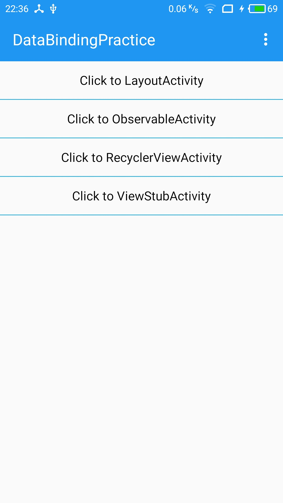
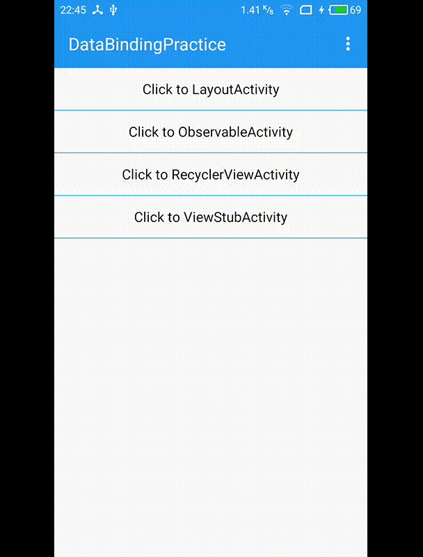
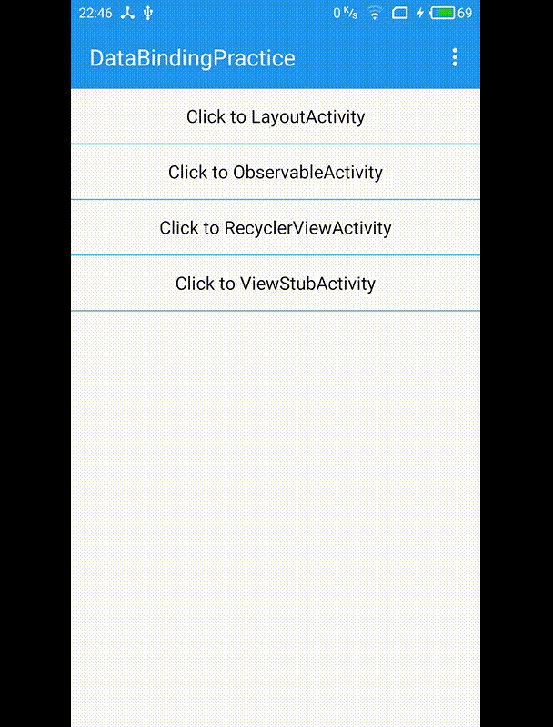
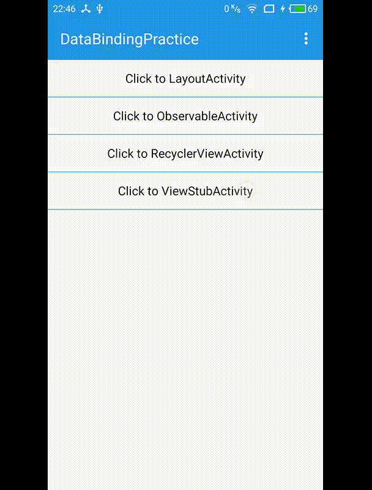
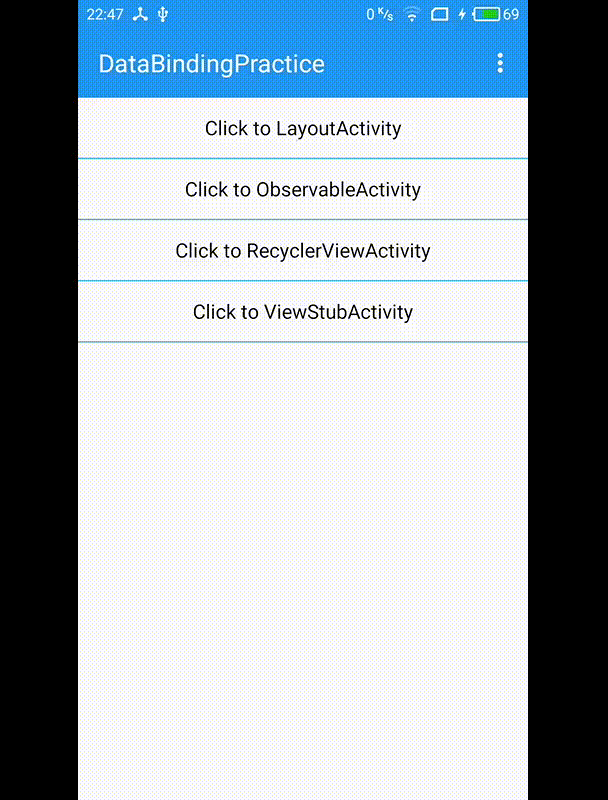

## DataBindingPractice

This is a demo for me to practice DataBinding and I hope this demo could help you,too.  

This demo doesn't follow strick Model-View-ViewModel or a Model-View-Presenter pattern, uses Data Binding Library.

I wrote two articles to introduce Data Binding Library.

* [Data Binding 数据绑定(一)](http://lijiankun24.com/DataBinding-%E6%95%B0%E6%8D%AE%E7%BB%91%E5%AE%9A1/)
* [DataBinding-数据绑定(二)](http://lijiankun24.com/DataBinding-%E6%95%B0%E6%8D%AE%E7%BB%91%E5%AE%9A2/)

Scan below QR code to download the apk.

    

### MainActivity

    

### LayoutActivity

    

### ObservableActivity

    

### RecyclerViewActivity

    

### ViewStubActivity

    

### AboutActivity

    

